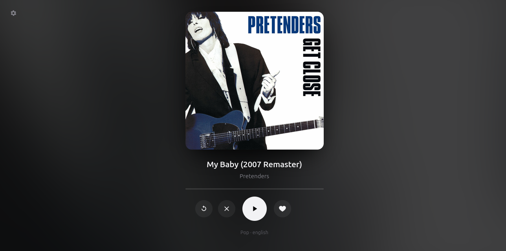
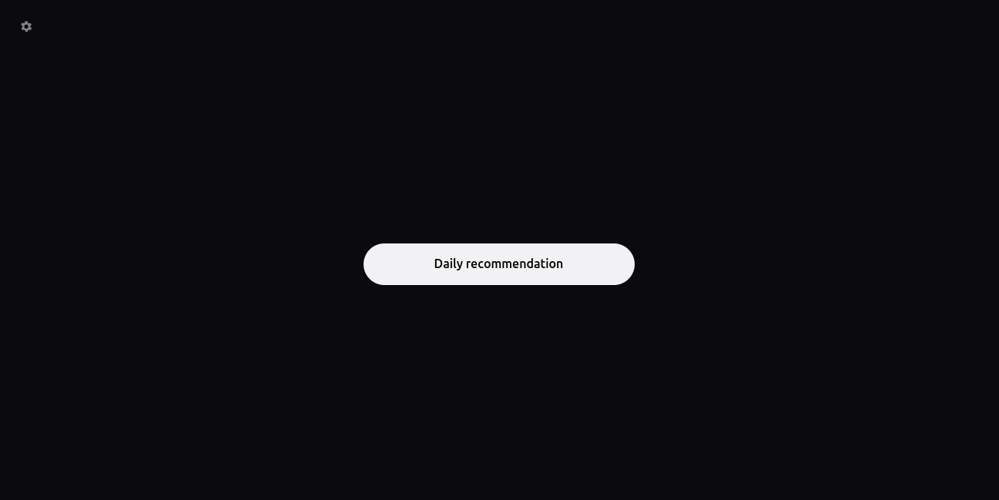
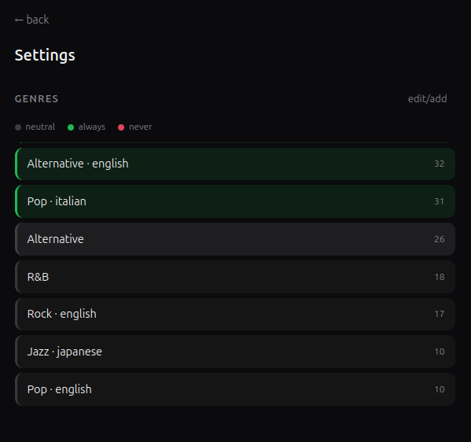
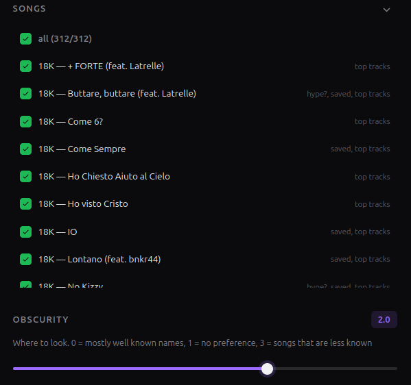
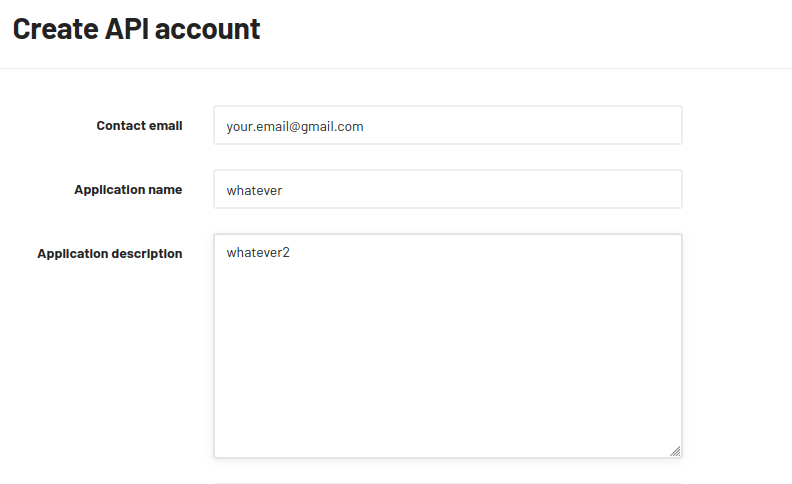
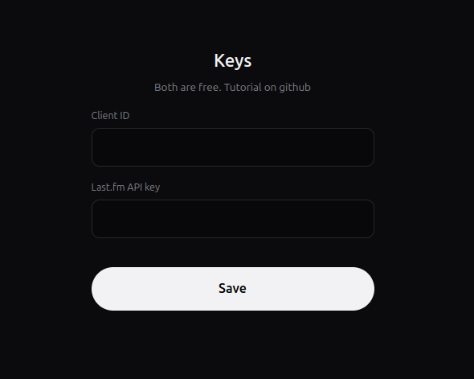

# Daily recommendation

I was bored of the discovery weekly and of my usual songs so I made this.
This app will recommend daily a new song that you hopefully have never heard before, based on what you have already listened to.
YOU NEED AT LEAST AN ACCOUNT WITH SPOTIFY PREMIUM TO USE THIS.
You also need python 3.9 at least.



## What it is for

Every day you can click on Daily recommendation and it will search for a song close to what your genres are.


- **Preview** every song has a 30 sec preview that you can use to decide if you like it or not 
- **Like/dislike** you don't like the song? Let the app know and it will memorize it and use it to give you the best suggestions next time.
- **Reroll** want another recommendation because you didn't like the last one? don't worry you can hit reroll and you will get another one, totally different genre.
- **Study noise filter** 40 Hz tones, binaural beats, rain, white noise and sleep playlists are filtered out. So you can still listen to them without contaminating your daily recommendations.
- **Customizable.** Every genre can be set to always, never or neutral, you can add
  genres by hand and decide what songs that have been found in your recents/saved count.




## Getting it running

### 1. Download it

get the zip on the releases tab and unpack it wherever you like

or

```
git clone https://github.com/Rosse211/spotify-daily-recommendation.git
cd spotify-daily-recommendation
```
in a terminal opened in the folder where you want the app to be installed.


### 2. Get a Spotify client ID

1. Go to <https://developer.spotify.com/dashboard>, login with your PREMIUM account and click **Create app**.
2. Name and description can be anything.
3. Under **Redirect URIs** add exactly:

   ```
   http://127.0.0.1:8888/callback
   ```

4. Tick **Web API**, save, then open **Settings** and copy the **Client ID**.

You need to do this to run the app because spotify doesn't allow more than 5 people on my developer app. 
You have to create yours, this also means that you can invite up to 4 people that don't need to have spotify premium(tutorial below under Invite Friends).


### 3. Get a Last.fm API key

1. Go to <https://www.last.fm/api/account/create>.

2. Name and description can be anything. Callback URL and homepage can be left empty.
3. The key appears immediately on the next page, copy it.


### 4. Start the app and paste the keys

Double click on app.py in src folder

or

run the app through python in the terminal in the app's folder:
```
python3 src/app.py 
```
for Linux and MacOS

```
py src/app.py 
```
for Windows

The first screen asks for the two keys. They are checked against Spotify and Last.fm before anything is stored: a wrong one is marked **not valid**
in red and nothing is saved until it works.




### 5. First run

On the first run it will ask you to login, you will need to do this only once if everything goes right, then you will be asked your preferences for the daily recommendation.


## Daily use

To open the app whenever you want bookmark <http://127.0.0.1:8080>, open app.py, use the .command if you are on linux/mac or the .bat if you are on windows.
If you are on windows you can also create a shortcut for the .bat if you want to use it from the desktop.
Make an alias if you are on Mac.

The pick is deterministic per day: the same day gives the same track even if you restart
the app, and nothing is ever suggested twice.


## Settings

The gear in the top left opens `/settings`.

- **Genres** — As in the welcome page. **edit/add** turns on removal, and lets
  you add any genre Last.fm knows about, either from the suggestions or by typing it.

- **Songs** — every track, click to switch one off so it stops counting towards your taste.
  With **only saved** selected, everything that is not a saved track it's not gonna be selected.
  You can sort them by name or if they are active or not by clicking on the arrow.

- **Obscurity** — a slider from 0 to 3, and a spectrum rather than an amount. At 0 you get
  the well known artists and their songs, at 1 you get no preference over the obscurity of the songs, at 3 mostly niche artists and obscure songs. Be aware that known artists can still appear but rarely at 3. 

- **Similar genres** — switch on or off the new genres option.
- **Keys** — the Spotify Client ID and Last.fm API key.
- Three red buttons at the bottom. **Log out of Spotify** logs you out and forgets everything so you can log in with another account **Reset likes and dislikes** forgets every vote and every banned artist(artists are banned after 3 dislikes).
  **Reload my library** reads your top tracks, saved tracks and playlists again from your spotify.

Changes save as you make them and clear the current pick, so the next one uses them.

Logging out is local: Spotify still has the app approved, so logging back in will not ask
for consent again if it's the same account. To undo that too, remove the app under Apps in your Spotify account.


## Tuning

If you ever want to tune the app's settings in a deeper way you will need to modify the python script:
At the top of `src/app.py`:

| Setting | Default | What it does |
|---|---|---|
| `TOP_GENRES` | `5` | How many genres start out green on the first run |
| `MAX_REROLLS` | `3` | Rerolls allowed per day |
| `DISLIKES_TO_BAN` | `3` | Dislikes on the same artist before they are banned |


## Files it creates

Everything the app writes lives in `data/`, `config.json` holds
the keys you typed in; the rest is a cache or your own history, and all of it is safe to
delete — the app rebuilds what it needs.


## Invite friends(MAXIMUM 4 other than yourself)

If you want to invite friends you just need to add them in the Spotify Developer Dashboard under User Management, you'll need to add the username and the mail. Then when your friend opens the app the Client ID will need the creator of the app's ID, but the last.fm API key will have to be new and specific for your friend.

## Todo in the future

- album recommendation
- shared recommendation between two or more people
- mini desktop app instead or in parallel with the web one

## License

[PolyForm Noncommercial 1.0.0](LICENSE). Use it, change it, build on it, redistribute it —
as long as it is not for commercial purposes. Personal use, hobby projects, study, research, schools and charities are all covered.


## Requirements

- **Python 3.9 or newer** Standard library only (if you add python.exe to the PATH you can use py/python3 to open the app from the terminal)
- **A Premium Spotify account**.
- **A Spotify client ID** and a **Last.fm API key**, both free, tutorial above.
- **A browser**, for the interface and the one-time login.
- Works on Linux, macOS and Windows.


## Problems

For any problems, any requests, any suggestion or anything that concerns the code don't be afraid to tell me or to open an issue. This is my first GitHub project so be understanding please.
